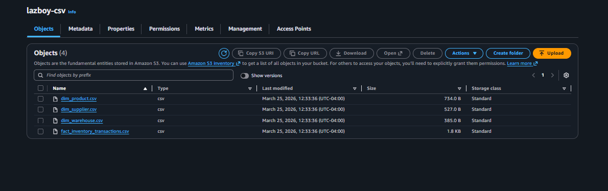
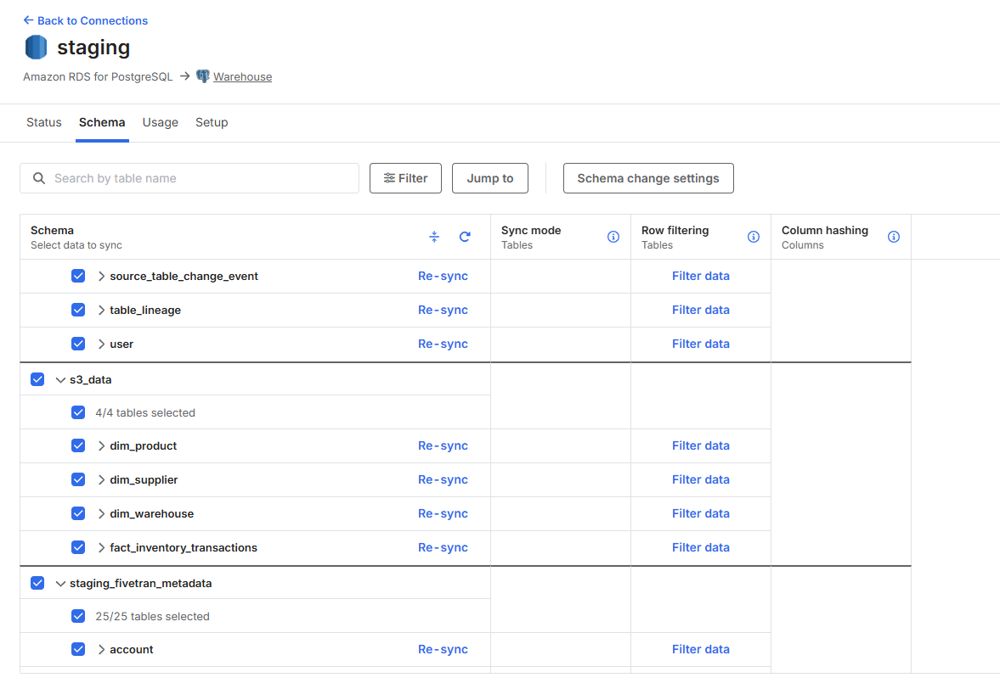
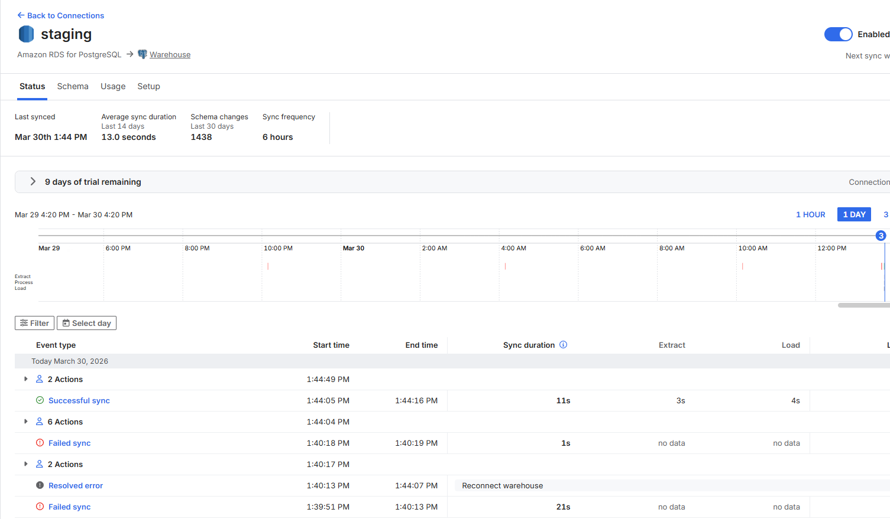
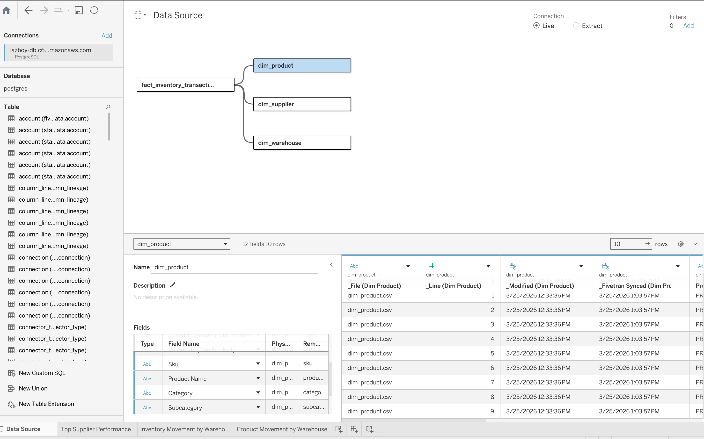
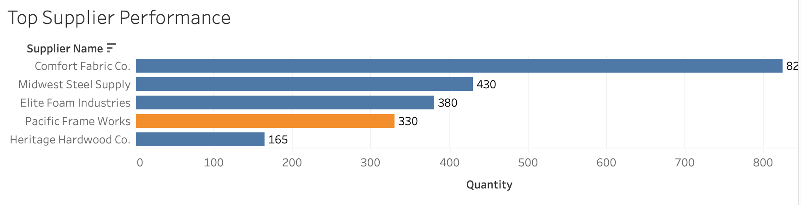
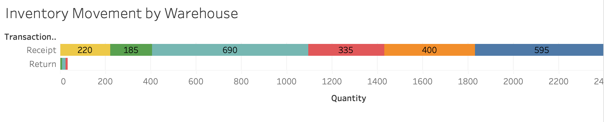
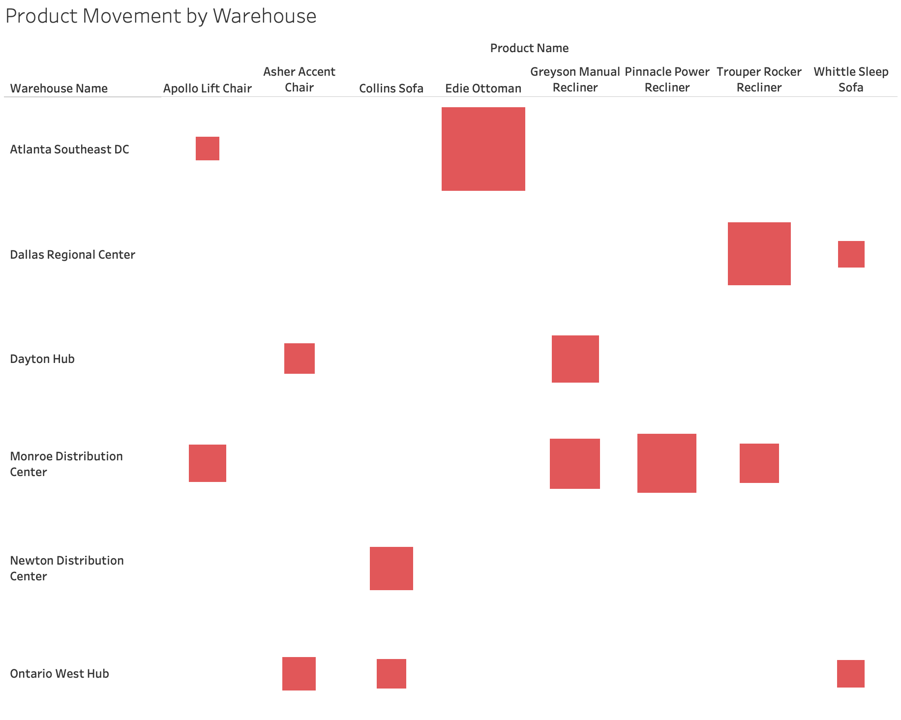

# Supply Chain Analytics (AWS + Fivetran + Tableau)

## Overview  
This project focuses on building an end-to-end data pipeline to analyze inventory and supply chain performance. The goal was to move raw data from cloud storage into a database and create dashboards that provide insight into supplier performance, warehouse activity, and product movement.

---

## Architecture  
S3 → Fivetran → PostgreSQL (RDS) → Tableau  

---

## Data Pipeline

### AWS S3 (Raw Data)  
Raw CSV files are stored in an S3 bucket and act as the data source for the pipeline.  

---

### Data Ingestion (Fivetran)  
Fivetran is used to extract data from S3 and load it into PostgreSQL. Selected tables include:

- fact_inventory_transactions  
- dim_supplier  
- dim_product  
- dim_warehouse  

---

### Sync Status  
Fivetran handles automated syncing and ensures data is updated on a scheduled basis.  

---

## Data Model (PostgreSQL / Tableau)  
Data is structured using a fact and dimension model. Tableau connects directly to PostgreSQL and joins the datasets to create a unified view for analysis.  

---

## Dashboard & Visualizations

### Top Supplier Performance  
Shows which suppliers contribute the most inventory volume and highlights key contributors.  

---

### Inventory Movement by Warehouse  
Displays the flow of inventory across warehouses, including receipts and returns.  

---

### Product Movement by Warehouse  
Breaks down product distribution across warehouse locations to identify concentration and movement patterns.  

---

## Key Insights

- Supplier performance varies significantly, with a few suppliers contributing the majority of inventory  
- Inventory movement differs across warehouses, indicating uneven distribution  
- Certain products are concentrated in specific locations, which may impact fulfillment efficiency  

---

## Notes

This project demonstrates an end-to-end data workflow, from cloud storage to database integration and visualization. All dashboards were built in Tableau using live connections to PostgreSQL.
